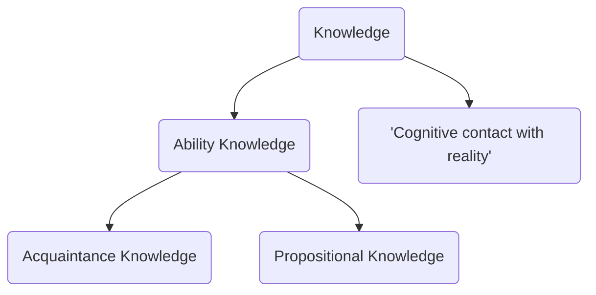

# What is Knowledge Summary


</br>

### Types of Knowledge

#### Ability Knowledge

‘<mark style="background: #D2B3FFA6;">Knowing how</mark>’, e.g. how to ride a bike

</br>

**Zagzebski defines the following two types of knowledge as involving ‘<mark style="background: #FF5582A6;">cognitive contact with reality</mark>’:**
#### Acquaintance knowledge

Knowledge that involves <mark style="background: #FF5582A6;">direct contact with something in experience</mark>, e.g. my knowledge of Oxford or my knowledge of my best friend. The word ‘know’ is normally followed by a noun or pronoun

#### Propositional knowledge

Knowledge <mark style="background: #FF5582A6;">about some part of reality</mark> (can be [[Philosophy/Glossary#a priori|a priori]] or [[Philosophy/Glossary#a posteriori|a posteriori]]) - the knowledge that a proposition is true or false (a proposition is a declarative statement, e.g. 2 + 2 = 4).


</br>

### The definition of knowledge

#### Necessary and Sufficient conditions

```ad-note
title: Necessary Conditions
A condition that something must meet to be part of a concept. In other words, if anything that does not have this condition it will not be part of that concept. For example, “unmarried” is a necessary condition of “bachelor” because you have to be unmarried to fit the concept of a bachelor.
```

```ad-note
title: Sufficient Conditions
color: 100, 200, 200
Conditions that, if all are met, guarantee that something is part of a concept. For example. “unmarried” and “man” are sufficient conditions of “bachelor” because everything that is an unmarried man is a bachelor. Being an unmarried man is sufficient to be a bachelor – you don’t need to meet any other conditions.
```
</br>

#### Can propositional knowledge be defined?

Propositional knowledge can only be defined if we can find necessary and sufficient conditions for knowledge, and these can be tested through counter-examples