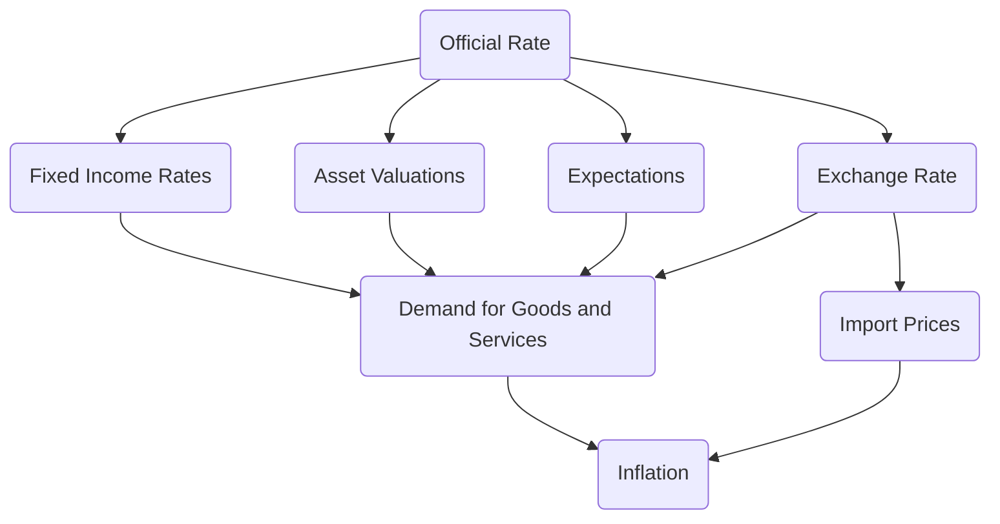

# Monetary Policy Revision

 

### Functions of a central bank

**Monetary policy function**

- Setting of the main monetary policy interest rate
- Quantitative Easing
- Exchange rate intervention (managed/fixed currency systems)

**Financial stability and regulatory function - supervision of the wider financial system**

**Policy operation functions**

- Managing liquidity in the commercial banking system
- Lender of last resort to the banking system

**Financial infrastructure provision function**

- Overseeing the payments systems used by banks/retailers/credit card companies
- Handling the issue and redemption of issues of government debt

 

### Factors influencing the MPC’s decisions

- The two year forecast for the inflation rate
- House prices
- The size of output gaps - spare capacity
- Changes in average earnings
- The exchange rate and international data
- Confidence surveys

 

### Instruments of Monetary Policy

#### **Transmission mechanism**

The ways the official interest rates feeds through the economy to reduce inflation

 

#### **Forward Guidance**

When the Central Bank announces to markets that it intends to keep interest rates at a certain level until a fixed point in the future.

 

#### **Funding for Lending (2012-2018)**

A scheme to boost bank lending. Commercial banks were able to borrow even more cheaply from the Bank of England, which allowed them to give cheap loans for firms and consumers

 

#### **Quantitative Easing - Asset Purchase**

Quantitative Easing is used to stimulate AD - loose monetary policy.

**Background**

*Bonds* are IOUs that pay an amount of interest that is fixed in cash terms - £5 per year, for example.

The *coupon* is the amount of interest that is applied to the nominal value of the bond.

The *yield* is the annual interest payment expressed as a percentage of the market price of the bond.

$Yield = \frac{Coupon}{Market Price} \times 100$

**What is Quantitative Easing?**

- Quantitative Easing is one of two tools used to change interest
- Used when interest rates are already very low
- Involves buying bonds to push up their price and bring down long term interest rates
- It supports the prices of other financial assets such as shares

**How does it work?**

- As the bond prices rise, the yield drops
