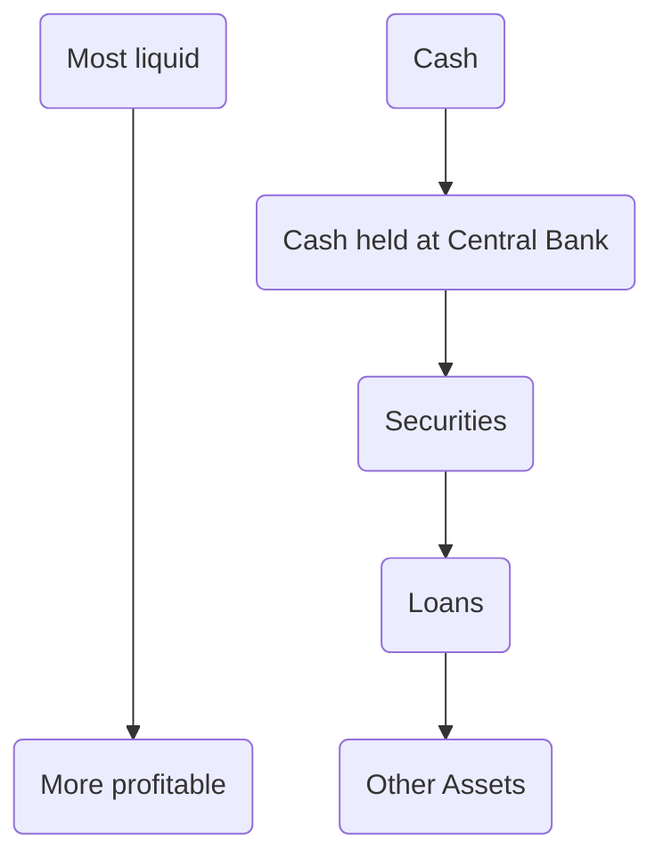

---
tags: Financial-Markets-and-Monetary-Policy
--- 

# Financial Markets

 

**The financial sector is a major part of the economy**.

It’s main function is to make money available to individuals and businesses. It helps economic growth - effective and efficient financial systems are vital.

### What is a financial market?

A financial market is a set of arrangements where buyers and sellers can buy or trade a range of services or assets that are fundamentally monetary in nature.

 

### Commercial and Investment Banks

#### Investment Banks

**E.g. Goldman Sachs**

These are often specialised for companies and big investors. Their functions include:

1) Underwriting and advising on securities, issues, and other forms of capital raising
2) Advice on mergers and corporate restructuring
3) Trading on capital markets (bonds and equities)
4) Corporate research and private equity investments (firms that are not publicly traded)

 

### How do banks fund their activities?

1) Borrowed funds from depositors. These funds are liabilities.
2) The bank’s capital - common shares and retained earnings/profit.

 

### Other institutions

- **Challenger banks**: traditional banks that aim to disrupt the industry by offering innovative services and better customer experiences
- **Shadow banking**: bank-like activities (mainly lending) that take place outside the traditional banking sector

 

### Commercial Banks Create Credit

- Most money is created when banks make loans - about 80%
- A loan becomes a deposit in an account - this increases the supply of money
- Banks do *not* need your savings to create loans
- At the time of the financial crisis, for example, banks held just £1.25 in reserves for every £100 issued as credit

 

### Assumptions

- One bank
- The bank only has cash (called an asset) which it uses to meet any cash withdrawals by customers
- To maintain the confidence of customers it decides to hold cash deposits equal to 10% of total customer deposits.

If a member of the public deposits £1000 in the bank, both assets and liabilities increase by £1000. A bank uses the cash deposit as a monetary base to launch profitable loans.

Another customer may need to borrow. The 10% cash ration means that whilst holding £1000 in assets it can lend £9000 to these customers.

| Assets                | Liabilities                |
| --------------------- | -------------------------- |
| Cash: £1000           | Deposit: £1000             |
| Advances: £9000       | Created deposits: £9000    |
| Total assets: £10,000 | Total liabilities: £10,000 |

 

### The structure of a commercial bank’s balance sheet

- Shows the assets and liabilities of a firm
- Assets must equal liabilities if the firm is solvent

> [!note] Assets

> Claims that a bank has against others and represents how a bank has used its funds

> [!note] Liabilities

> 
> Claims that other people have on a bank and show the source of bank funds

 

In a balance sheet, *assets* should be **equal to** *liabilities*

| Assets (£ billion)            | Liabilities (£ billion)        |
| ----------------------------- | ------------------------------ |
| Cash: 20                      | Customer Deposits: 700         |
| Cash held at Central Bank: 70 | Money owed to Central Bank: 30 |
| Securities held: 130          | Money owed to other banks: 170 |
| Loans: 730                    | Shareholder’s equity: 100      |
| Other assets: 50              |                                |
| **Total assets:** 1000        | **Total liabilities: 1000**    |

- Shareholder’s funds -  they are not owned by the bank, but are owed to the shareholders and retained profit
- Customer deposits - can be called on at any time

 

### Levels of Capital are *vital*

- The amount of credit a bank can create depends on how much capital the bank holds
- Banks will try to keep ratio of loans to capital within a certain limit (approx. 3%)
- If the value of a bank asset falls, the bank’s capital is reduced by the same amount (assets = liabilities)
- This will reduce the amount of credit a bank can create

 

### Objectives of a commercial bank

- A bank will aim to hold a variety of different types of asset to achieve a suitable balance of liquidity, security, and profitability. The most profitable assets are usually the most risky.

#### Profitability

A bank is a firm and needs to make a profit. They are trying to satisfy the needs and wants of the shareholders.

**Sources of profit for commercial banks**

- Interest rate spreads - i.e. charging a higher rate of interest on loans than is paid to savers
- Service fees - such as fees for arranging a new loan
- Brokerage percentages on services such as currency exchange and buying/selling stocks and shares

**Liquidity**

Liquidity is the ability of a bank to meet demands for payment by depositors.

- The rate of return on illiquid assets is high - banks will want less liquid assets
- Banks need to hold enough liquid assets to allow deposits to be withdrawn
- Liquidity and profitability need to be carefully balanced

**Security**

Security restricts profitability. Prudent retail banking requires banks to operate on ratios of cash and other liquid assets to advances that maintain customer’s confidence in the bank, whilst generating profit. Secured loans such as a mortgage are less risky for banks.

**How much capital?**

The first step to working out how much capital a bank needs is to add up all of its assets. These assets include loans (such as mortgages or personal loans) and securities (such as shares and bonds that the bank owns) because these are the areas where it could lose money.

The next step is to make the bank set aside a percentage of these assets as capital to pay for potential losses. A bank can increase its capital by: **1)** holding back some of the money it makes during good times rather than paying it out to investors as dividends or to staff as bonuses; **2)** selling some new shares to make money.

 

