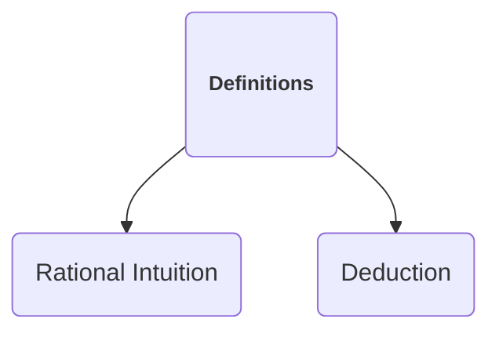
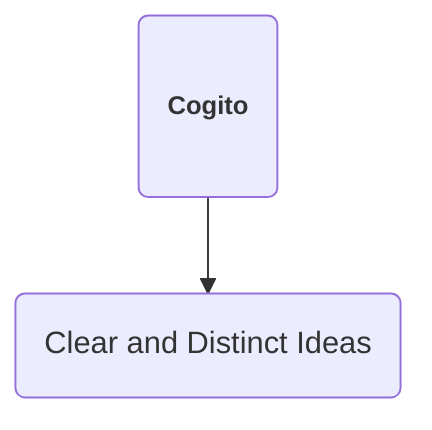
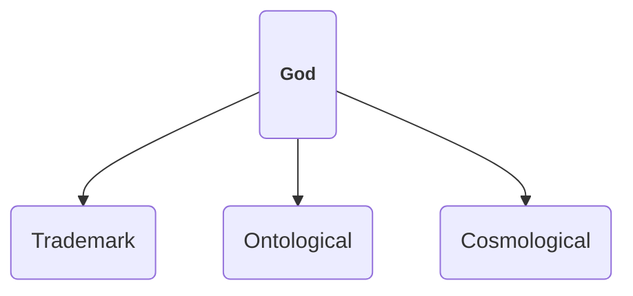
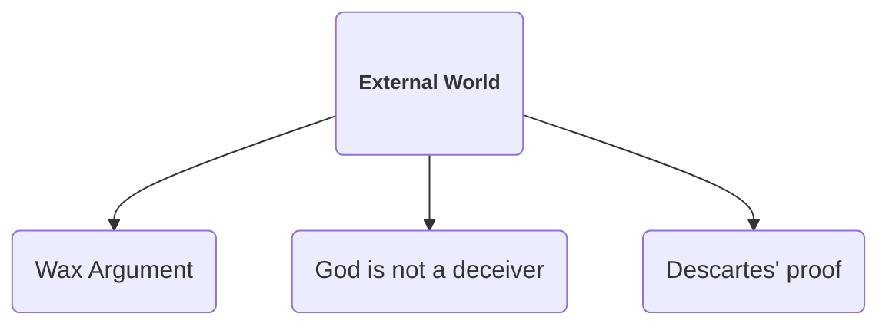
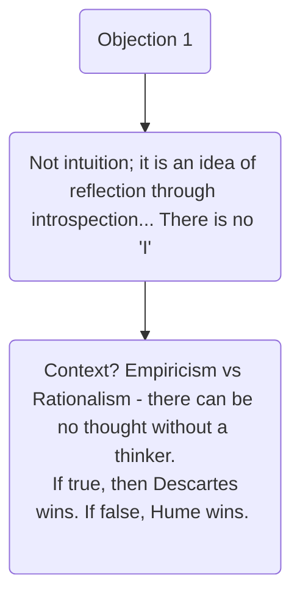
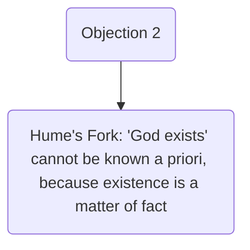

# Lacewing Day Pt. 2

### 12 Markers

**A 12 Mark answer is:**

- Fully detailed
- Correct - precise
- Logical structure and integration

 

### Rational Intuition and Deduction 25 Mark Essay

#### Descartes’ Arguments

 

#### Objections and Responses

 

### Euthyphro Dilemma

- God is omnipotent, omniscient, and omnibenevolent
- God wills what is morally good - which is independent of God’s will. This would mean that **God is not omnipotent**
- What is morally good is whatever God wills - God’s will is the standard of what is morally good. **This creates  a tautology: ‘God wills what God wills’**
- What, then, does it mean to say that God is good? We cannot know…
- The issue with this is that it gives grounds for us to argue that morality is arbitrary. But surely this is not what we believe?

 

### Malcolm’s Ontological Argument

