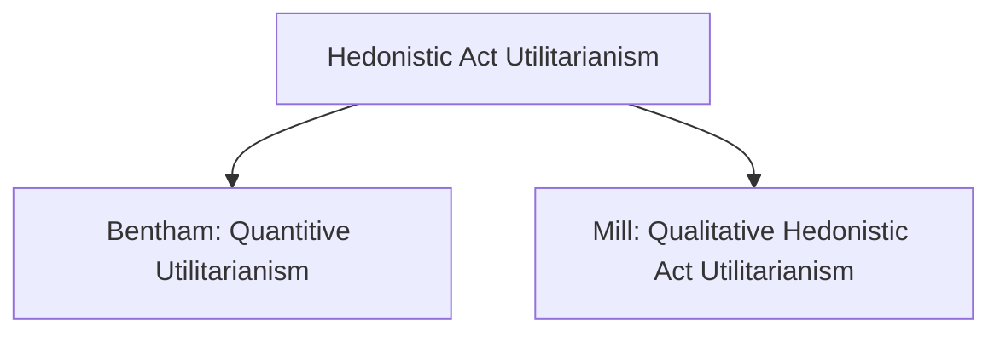

# What is Bentham's Quantitative Utilitarianism? (Revised From Prep)

 

## a) Introduction to Utilitarianism
 

### Explain the three claims that define utilitarianism in its simplest form

- <aside>
Definition of What is 'right': What is 'right' are actions that aim to produce the greatest happiness (of the greatest number) n.b. actions are right or wrong in view of their consequences  - what state of affairs do they result in - focus on outcomes, specifically act consequentialism

Definition of What is 'good': The only/ultimate good is happiness (Happiness = Pleasure)

Definition of Who counts?: Utilitarianism has an egalitarian apporach to happiness - everyone's happiness is of equal importance ('everyone' is an equal member in "the number")
</aside>What is right? Utilitarianism is based on consequentialism, and an act can be considered to  be 'right' if it maximises what is considered to be 'good'
- What is good? Utilitarianism states that the only thing that can be good is happiness (pleasure and the absence of pain). this is known as 'hedonism' (from greek for pleasure)
- Who counts? Utilitarianism has a commitment to equality, so no one's happiness comes before another's

 
 

### What does it mean to 'maximise happiness' 
<aside>Utilitarianism's aim is to decide between alternative possibilities based on maximising the happiness of all those affected (maximise = right, minimise = wrong)</aside>

Maximising happiness means that the greatest number of people are as happy as they possibly can be

 
 

### What is the 'greatest happiness'?
<aside>Greatest happiness: Comparative - The action that leads to the greatest happiness is the only action that could have led to that outcome</aside>
The greatest happiness is the criteria for an act to be right. Even if an act provides some happiness to people, if another act could have led to more happiness, then it was not the right course of action. The act that you undertake must provide the greatest happiness when compared to all other acts

 
 

### What is 'act utilitarianism'?
<aside> 
Simple and clear decision making process based on assessing the qualities of available alternative actions, i.e. what will happen if we take this action or that action? Which action will maximise happiness

Sole moral consideration is happiness
</aside>
In act utilitarianism, the only thing that matters is happiness. It seems a clear and simple way to make decisions, by maximising happiness for the greatest number. Act utilitarianism uses consequences to guide decision making, and these consequences can be proved empirically

 
 

## (b) Bentham's quantitative utilitarianism
 

 

### Explain the principle of 'utility'
<aside>Also known as 'the greatest happiness principle'. States that when judging the morality of an action we assess the option that will result in the greatest pleasure; Or, the end (aim) of human action is the greatest happiness of all those whose interest is considered.</aside>
The principle of utility can be described as 'the greatest happiness for the greatest number'. It is the guiding principle of act utilitarianism, claiming that when judging actions to be morally right or wrong, we should only take into account the happiness or 'utility' that said action will bring
 

### Explain what Bentham means by Utility
<aside>In short, an object has utility to the extent that it produces happiness (pleasure). There are five 'families' of pleasure: sensory pleasure, the pleasure of exercising skills, the pleasure of exercising power, the pleasure of memory, and the pleasure of benevolence.</aside>
Bentham defines utility as a 'property in any object, whereby it tends to produce benefit, advantage, pleasure, good, or happiness, or to prevent the happening of mischief, pain, evil or unhappiness to the party who's interest is concerned'. What Bentham means by this is that Utility is a property that makes an action 'right' due to it bringing happiness or preventing unhappiness
 
 

### Explain Bentham's 'felicific calculus' (also known as 'hedonic' or 'utility' calculus) for measuring pleasure or pain
<aside>Bentham's Utilitarianism talks of greater and lesser amounts or quantities of pleasure. But how do we measure these quantities? Using the felicific calculus....

There are seven criteria:   
- Duration: How long does the pleasure last?  
- Purity: How unlikely is it to be 'contaminated' by pain?  
- Intensity: How 'strong' is it?  
- Fecundity: How likely is it to result in future pleasure?  
- Certainty: How reliable is it?  
- Propinquity: How accessible/near is it?  
- Extent: How wide is its effect?
</aside>
Bentham claimed that we could measure pleasure and pain on a single scale, using the process of 'felicific calculus'. Through this method, 'if a pleasure is more intense, will last longer, is more certain to occur, will happen sooner rather than later, or will produce in turn many other pleasures and few pains, it counts for more'(*Philosophy for AS and A Level, Lacewing, p. 207*). In addition, the more people that you positively affect through your actions, the better. The total amount of happiness produced is the sum total of everyone's pleasure's produced minus the sum total of everyone's pains.
 

### What is the 'intuitive appeal' of Bentham's utilitarianism?
<aside>- The aim of Utilitarianism is to maximise happiness - and we all desire happiness (pleasure rather than pain)

- If happiness is good -then it follows that more happiness is better

- In appealing to something we all want (i.e happiness), Utilitarianism motivates us to act morally

- Unless we have reason to think otherwise, the idea is that everyone's happiness is of equal importance coincides with our liberal/egalitarian/christian 'intuitions'
</aside>
Bentham's utilitarianism has 'intuitive appeal' for one main reason. Everyone cares about happiness (Bentham claims that this is in fact the sole thing that motivates people). If happiness is good, then it is perfectly reasonable to want more of it, so we should therefore maximise it. In addition, treating people as equal is an appealing method
 
 
 
 
 

### How might Bentham's utilitarianism be criticised as simplistic and/or narrow?
<aside>- Is happiness the only good? is pleasure the sole moral concern?

- What happens when maximising the general happiness conflicts with an individuall's rights? (Bentham answered this by saying that rights don't exist - "nonsense on stilts")

- An apparently straightforward decision making formula - 'Greatest happiness for the greatest number' - looks rather less straightforward once the criteria of the felicific calculus are interrogated ('problems of calculation')
</aside>

 - Happiness is *not* the only good
 - We cannot empirically investigate happiness
 - There are circumstances in which we should not maximise happiness
 - While morality may not have something to do with happiness, it is narrow-minded to confine morality to a single measure of 'good'
 
