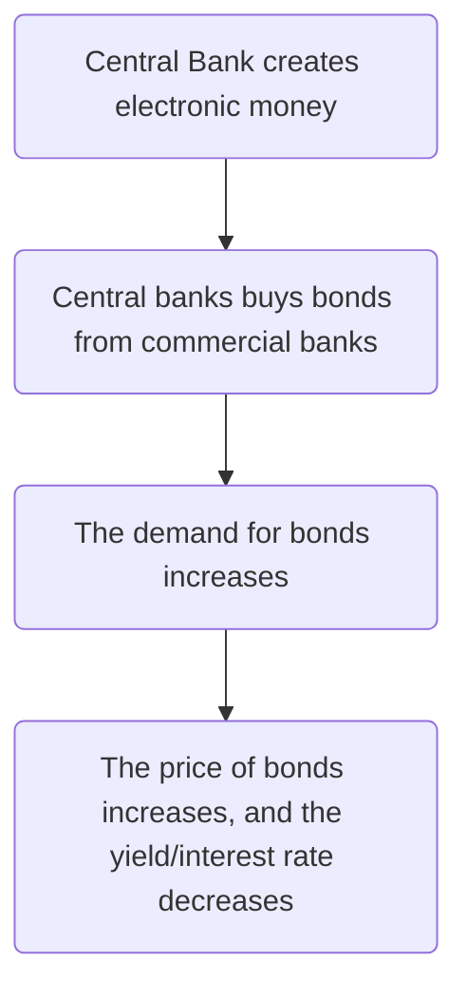

# Quantitative Easing Process

 

```mermaid
graph TD;

id1(Central Bank creates electronic money)

id1-->id2(Central banks buys bonds from commercial banks)

id2 --> id3(The demand for bonds increases)

id3 --> id4(The price of bonds increases, and the yield/interest rate decreases)
```
