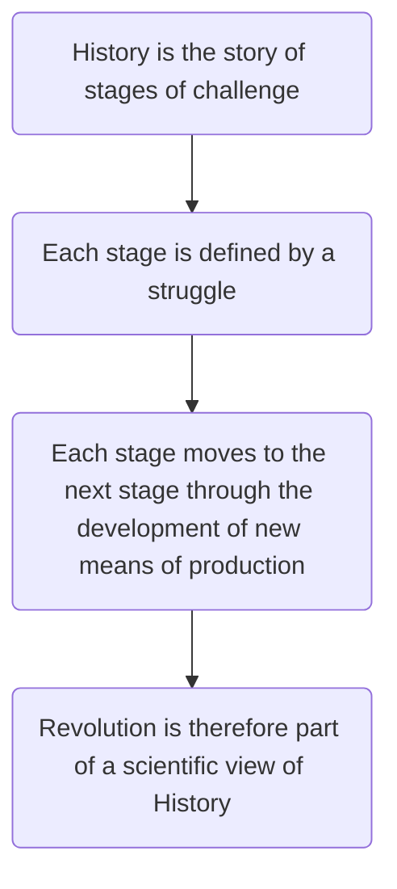

# Russian Ideology

 

### Forms of ideology

- Autocracy
- Early attempts at peasant-based socialism - going to the people
- Early Russian Marxism - Plekhanov
- Liberals/Kadets/The Duma/Constitutionalism
- Popularity of SRs - Land reform above all else
- SD split - Bolsheviks ad Mensheviks
- Debates within Bolshevik/Communist Party and Communist state

 

## Marxism
### 3 Elements

- Productive forces/means of production - things used to produce
- Relations of production - owning and hiring (relationship between workers and owners)
- Superstructure - government, religion, ideology

For Marx, the relations of production was where the **challenge** took place, and this relationship would define what the superstructure looked like

 

### Historical Materialism

#### Stages of History

- Hunter/gatherer
- Slavery
- Fedualism
- Capitalism

**Further stages to come:**

- Socialism
- Communism

 

### The downfall of Capitalism

**Ideology came second to Materialism**. It was a way of justifying an existing form of society

**Capitalism had occurred because** feudal lords had started trading to make more money, which led to the downfall of the lords because trade led to the rise of the middle classes. **Classical liberal ideas** justify this type of society

**Capitalism’s profit motive** created a large industrial working class (proletariat) in order to make the bourgeoisie more money

**Because Capitalism was all about making money for the owners**, it was inevitable that wages of the industrial workers would aways settle at the lowest point for survival and work

**The gap would eventually become so great** that the working class would develop **class consciousness** and overthrow the bourgeoisie

 

### Application

- Marx saw developed, industrialised countries as the ones ready for revolution, i.e. Britain and Germany
- This did *not* include Russia, which was still in a semi-feudal, peasant-based state
- But the principle that materialism and material events shaped ideas, not the other way around, gave Lenin and his contemporaries the leeway to adapt his theories to suit them
- In an echo of Marx’s thoughts, they used their own ideological developments to justify the kind of state they were creating